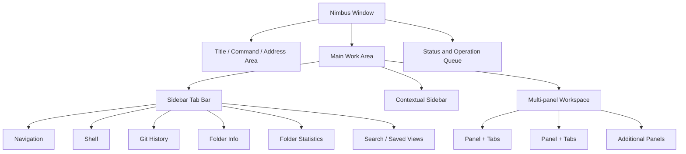

# Nimbus Product Requirements Document

- 문서 상태: Draft
- 작성일: 2026-07-21
- 대상 플랫폼: Windows 11
- 기술 기반: Rust, GPUI, Windows API

## 1. 제품 개요

Nimbus는 Windows 파일 탐색기를 그대로 복제하는 프로그램이 아니라, 여러 위치의 파일을 동시에 탐색하고 비교하며 안전하게 처리할 수 있는 **파일 작업 워크벤치**를 지향한다.

핵심 차별점은 다음 세 가지다.

1. 단일 또는 듀얼 패널에 한정되지 않는 유연한 멀티 패널 작업 공간
2. 탐색, Shelf, Git 이력, 폴더 정보와 통계 등을 제공하는 확장 가능한 탭형 Sidebar
3. 많은 기능을 제공하면서도 필요한 기능만 점진적으로 노출하는 단순하고 일관된 UI/UX

## 2. 문제 정의

기본 Windows 11 파일 탐색기는 일반적인 파일 열기와 관리에는 충분하지만, 다음과 같은 복합 작업에서는 사용 흐름이 쉽게 끊어진다.

- 서로 다른 여러 폴더를 비교하거나 파일을 옮기려면 탭과 창을 반복해서 전환해야 한다.
- 복사, 이동, 일괄 이름 변경의 결과와 충돌을 실행 전에 파악하기 어렵다.
- 파일 내용을 확인하기 위해 매번 연결된 애플리케이션을 실행해야 한다.
- 서로 다른 폴더에서 수집한 파일을 잠시 모아 두거나 하나의 작업 단위로 다루기 어렵다.
- Git 상태, 폴더 크기, 파일 유형 분포 같은 문맥 정보를 별도 도구에서 확인해야 한다.
- 기능이 많은 대체 파일 관리자는 화면이 복잡하고 학습 비용이 높아지기 쉽다.

## 3. 제품 목표

### 3.1 핵심 목표

- 여러 폴더를 한 화면에서 동시에 탐색하고 비교할 수 있게 한다.
- 파일 복사, 이동, 이름 변경을 빠르고 예측 가능하며 되돌릴 수 있게 한다.
- 파일과 폴더에 관한 문맥 정보를 현재 작업 흐름 안에서 제공한다.
- 마우스와 키보드 사용자 모두가 효율적으로 사용할 수 있게 한다.
- 기능이 추가되어도 기본 화면의 시각적 복잡도가 크게 증가하지 않게 한다.
- 로컬 폴더에서 즉각적으로 반응하고 대용량 폴더에서도 UI가 멈추지 않게 한다.

### 3.2 비목표

초기 버전에서는 다음을 목표로 하지 않는다.

- 파일 동기화 또는 클라우드 스토리지 서비스 자체 구현
- Git 클라이언트의 모든 기능 제공
- Windows Shell의 모든 동작과 UI를 완전히 재현
- 전문 디스크 복구 또는 포렌식 기능
- 자연어 AI 기능을 핵심 탐색이나 파일 작업의 필수 요소로 사용

## 4. 대상 사용자

### 4.1 개발자와 기술 사용자

- 여러 저장소, 빌드 결과, 로그와 배포 폴더를 자주 오간다.
- Git 상태와 파일 변경 이력을 파일 탐색 과정에서 확인하고 싶다.
- 경로 복사, 터미널 열기, 파일 비교 같은 작업을 자주 수행한다.

### 4.2 콘텐츠 및 사무 작업 사용자

- 이미지, 문서, 다운로드 파일을 미리보기로 빠르게 분류한다.
- 여러 폴더에서 파일을 수집해 전달하거나 정리한다.
- 대량 이름 변경과 중복 파일 정리가 필요하다.

### 4.3 고급 Windows 사용자

- 기본 탐색기의 단순함은 유지하면서 더 강력한 작업 흐름을 원한다.
- 반복 작업을 단축키, 명령 팔레트 또는 저장된 작업 공간으로 자동화하고 싶다.

## 5. 제품 설계 원칙

### 5.1 Progressive Disclosure

기본 상태에서는 탐색과 파일 목록에 집중한다. 고급 정보와 도구는 Sidebar 탭, 명령 팔레트, 컨텍스트 메뉴를 통해 필요할 때만 연다.

### 5.2 Context First

Sidebar와 명령은 현재 활성 패널과 선택 항목을 기준으로 동작한다. 사용자가 명령 대상이 어디인지 추측하지 않게 한다.

### 5.3 Reversible by Default

삭제는 휴지통을 기본으로 사용하고, 복사·이동·이름 변경은 작업 이력과 가능한 범위의 Undo를 제공한다. 대량 작업은 실행 전 결과를 미리 보여준다.

### 5.4 Keyboard and Mouse Parity

핵심 기능은 마우스와 키보드 양쪽에서 접근할 수 있어야 한다. 단축키는 화면의 Tooltip과 명령 팔레트에서 발견할 수 있어야 한다.

### 5.5 Responsive by Design

디렉터리 조회, 폴더 크기 계산, Git 조회, 검색과 미리보기 생성은 백그라운드에서 처리한다. 오래 걸리는 작업은 취소할 수 있어야 한다.

### 5.6 Familiar, Then Powerful

파일 선택, 드래그 앤 드롭, `Ctrl+C/V/X`, `F2`, `Delete`, `Alt+Left/Right` 등 Windows 사용자가 익숙한 동작을 유지한다. Nimbus 고유 기능은 익숙한 흐름 위에 추가한다.

## 6. 정보 구조

### 6.1 화면 영역

- **상단 명령 영역:** 뒤로, 앞으로, 상위 폴더, 주소, 검색, 레이아웃 전환, 명령 팔레트
- **Sidebar Tab Bar:** 사용할 Sidebar 기능을 선택하는 좁은 아이콘 영역
- **Contextual Sidebar:** 선택한 도구의 콘텐츠를 표시하며 접기와 크기 조절 지원
- **Multi-panel Workspace:** 하나 이상의 파일 패널을 자유롭게 분할하고 배치
- **상태 및 작업 영역:** 선택 항목 수, 용량, 백그라운드 진행 상태, 파일 작업 큐 표시

## 7. 핵심 기능 요구사항

### 7.1 멀티 패널 작업 공간

멀티 패널은 Nimbus의 핵심 작업 모델이다. 각 패널은 독립된 탐색기이며 자체 탭, 위치 기록, 정렬, 필터와 선택 상태를 가진다.

#### 필수 기능

- 단일, 좌우 2분할, 상하 2분할, 3분할, 2x2 레이아웃 제공
- 패널을 가로 또는 세로 방향으로 재귀적으로 분할
- 분할 경계 드래그를 통한 크기 조절
- 패널별 복수 탭과 탭 고정
- 탭이나 폴더를 드래그하여 새 패널 생성
- 활성 패널을 명확하지만 과하지 않은 강조로 표시
- 패널 간 드래그 앤 드롭 복사와 이동
- 활성 패널을 원본 또는 대상으로 지정하는 명확한 파일 작업 UI
- 자주 사용하는 구성을 레이아웃 프리셋으로 저장
- 종료 후 패널 구성, 탭, 경로, 정렬과 스크롤 위치 복원

#### UX 제한과 가이드

- 내부 모델은 임의의 재귀 분할을 지원하되 초기 UI는 최대 4개 패널을 권장한다.
- 새 사용자는 단일 패널로 시작하고 분할 기능을 선택했을 때만 추가 패널을 본다.
- 패널이 좁아지면 중요도가 낮은 메타데이터 열을 순차적으로 숨긴다.
- 모든 파일 명령은 활성 패널과 대상 패널을 시각적으로 표시한다.

#### 확장 아이디어

- 두 패널이 동일한 상대 경로를 함께 이동하는 동기화 탐색
- 두 폴더의 누락 파일, 수정 시각, 크기 차이를 표시하는 비교 모드
- 특정 패널을 검색 결과, Git 변경 파일 또는 Shelf 내용에 고정

### 7.2 탭형 Sidebar 플랫폼

Sidebar는 단순한 폴더 트리가 아니라 현재 파일 작업을 지원하는 도구 플랫폼이다. 각 기능은 독립된 탭으로 제공하며 현재 활성 패널과 선택 항목의 문맥을 따른다.

#### 공통 동작

- 아이콘 기반의 Sidebar Tab Bar 제공
- 한 번에 하나의 기본 도구만 열어 화면 복잡도 제한
- Sidebar 접기, 고정, 폭 조절 지원
- 탭별 로딩, 빈 상태, 오류 상태와 새로고침 제공
- 패널이 바뀌면 현재 도구의 정보를 새 활성 패널에 맞게 갱신
- 사용하지 않는 무거운 기능은 지연 로딩
- 알림이 필요한 탭에만 작은 배지 표시

#### Navigation 탭

- Quick Access, 드라이브, 네트워크 위치, 최근 위치
- 즐겨찾기 폴더 고정과 순서 변경
- 폴더 트리의 지연 로딩
- 저장된 검색과 가상 폴더 진입점

#### Shelf 탭

Shelf는 여러 위치의 파일과 폴더를 임시 또는 지속적으로 모아 두는 공간이다. 실제 파일을 이동하지 않고 원본에 대한 참조를 보관한다.

- 드래그 앤 드롭 또는 단축키로 선택 항목 추가
- 서로 다른 패널과 폴더에서 항목 수집
- Shelf에서 활성 패널로 복사 또는 이동
- 선택 항목 압축, 공유, 경로 복사, 일괄 이름 변경
- 여러 개의 이름 있는 Shelf 생성
- 세션 간 Shelf 유지 여부 선택
- 원본이 이동되거나 삭제된 항목은 손실 상태로 표시하고 복구 경로 안내
- Shelf 항목에 간단한 메모 또는 색상 표시

#### Git History 탭

현재 폴더가 Git 저장소 내부일 때만 활성화한다.

- 현재 브랜치, 변경 파일 수, 저장소 루트 표시
- 최근 커밋 목록과 작성자, 시각, 메시지 표시
- 선택한 파일의 변경 이력 필터링
- 커밋에 포함된 변경 파일 목록 표시
- 변경 파일을 해당 패널에서 바로 찾기
- 초기 단계에서는 읽기 전용으로 제공하고 commit, rebase 같은 변경 작업은 제외

#### Folder Info 탭

- 전체 경로와 경로 형식별 복사
- 생성 및 수정 시각, 파일 시스템 속성
- 파일 및 하위 폴더 수
- 전체 크기와 디스크 사용량
- 읽기 전용, 숨김, 권한 정보
- 네트워크 또는 클라우드 위치 상태
- 폴더 크기 계산 진행률과 취소

#### Folder Statistics 탭

- 파일 유형별 개수와 용량 분포
- 가장 큰 파일과 폴더
- 최근 수정된 파일
- 오래된 파일과 빈 폴더
- 중복 가능 파일의 후보
- 결과 선택 시 해당 파일을 활성 패널에서 강조
- 대용량 폴더는 표본 또는 점진적 결과를 먼저 표시

#### Search / Saved Views 탭

- 현재 폴더, 활성 패널, 열린 모든 패널, 지정 경로 검색 범위
- 파일명 Fuzzy Search와 Glob 패턴
- 확장자, 크기, 날짜, 숨김 파일 등의 필터 Chip
- 검색 조건 저장과 가상 폴더처럼 재사용
- 검색 중에도 점진적으로 결과 표시

### 7.3 빠른 미리보기

- 파일 선택 후 `Space`로 Quick Look 표시
- 이미지, 텍스트, Markdown, PDF, 동영상과 일반적인 Office 문서 지원을 단계적으로 추가
- 방향키로 같은 폴더 또는 선택 항목의 다음 파일 탐색
- 미리보기에서 파일명, 크기, 수정 시각과 경로 표시
- 작은 임시 Overlay와 고정 가능한 Preview Sidebar 모드 제공
- 미리보기 생성이 실패해도 탐색 UI는 영향을 받지 않음

### 7.4 안전한 파일 작업과 작업 큐

- 복사, 이동, 삭제, 이름 변경, 새 폴더 생성
- 복수 작업을 순서대로 관리하는 작업 큐
- 개별 작업 일시 정지, 재개와 취소
- 충돌 발생 시 덮어쓰기, 건너뛰기, 이름 변경을 개별 또는 일괄 적용
- 대량 이동 및 이름 변경 전 예상 결과 미리보기
- 완료, 실패, 건너뜀 결과 요약
- 가능한 작업에 대해 Undo 제공
- 삭제 기본값은 Windows 휴지통 사용
- 애플리케이션이 종료되어도 진행 중 작업을 안전하게 정리하거나 다음 실행 시 상태 안내

### 7.5 명령 팔레트와 자동화

- `Ctrl+Shift+P`로 사용 가능한 명령 검색
- 명령 이름, 설명, 단축키와 현재 실행 가능 여부 표시
- 현재 선택과 활성 패널을 명령 입력으로 사용
- 자주 쓰는 명령 기록
- 사용자 정의 단축키
- 추후 반복 작업을 작은 Workflow로 저장

예시 명령:

- 선택 파일의 경로를 Windows, PowerShell, URI 또는 WSL 형식으로 복사
- 현재 폴더에서 터미널 열기
- 최근 수정된 PDF만 표시
- 선택한 파일명 앞에 날짜 추가
- 현재 패널을 좌우로 분할
- 선택 항목을 특정 Shelf에 추가

### 7.6 작업 공간과 상태 복원

- 패널 레이아웃, 열린 탭, Sidebar 탭과 폭 저장
- 프로젝트 또는 목적별 이름 있는 Workspace 저장
- 앱 재실행 시 마지막 Workspace 복원
- 잘못 복원된 네트워크 경로나 제거된 드라이브는 전체 실행을 막지 않고 오류 상태로 표시
- 선택적으로 특정 Workspace를 바로 여는 명령행 인자 제공

### 7.7 Windows 특화 기능

- Windows Shell 아이콘과 파일 연결 프로그램 사용
- 파일을 점유한 프로세스 확인
- 긴 경로, UNC 및 네트워크 드라이브 지원
- 바로가기 대상 확인과 실제 위치 열기
- 파일 속성과 알려진 폴더 연동
- 관리자 권한이 필요한 작업을 일반 작업과 구분
- Git 저장소 파일 상태 배지

## 8. UI/UX 요구사항

### 8.1 시각적 복잡도 관리

- 기본 화면에는 현재 작업에 필요한 도구만 표시한다.
- Sidebar는 기본적으로 하나만 열고 보조 정보는 접힌 상태나 Tooltip으로 제공한다.
- 툴바 버튼은 사용 빈도가 높은 항목만 노출하며 나머지는 명령 팔레트와 메뉴에 배치한다.
- 패널 수가 늘어날수록 자동으로 정보 밀도를 조정한다.
- 색상만으로 활성, 오류, Git 상태를 구분하지 않고 아이콘이나 텍스트를 함께 사용한다.

### 8.2 일관된 상호작용

- 모든 패널은 동일한 선택, 탐색, 정렬과 드래그 규칙을 사용한다.
- 클릭은 선택, 더블클릭은 열기, `Enter`는 열기, `Space`는 미리보기로 통일한다.
- 뒤로, 앞으로, 상위 폴더 동작은 활성 패널에만 적용한다.
- 파일 작업의 원본, 목적지와 예상 동작을 실행 전에 명확히 표시한다.
- 위험한 작업은 확인하되 반복적인 저위험 작업에는 불필요한 Modal을 사용하지 않는다.

### 8.3 발견 가능성

- 아이콘에는 설명과 단축키가 포함된 Tooltip을 제공한다.
- 첫 분할, 첫 Shelf 사용 등 핵심 기능은 짧은 Contextual Hint로 안내한다.
- 명령 팔레트에서 UI에 보이지 않는 기능까지 검색할 수 있게 한다.
- 빈 화면은 단순 메시지 대신 다음 행동을 안내한다.

### 8.4 접근성

- 키보드만으로 패널, 탭, Sidebar와 파일 목록 사이를 이동할 수 있어야 한다.
- 명확한 Focus Indicator를 제공한다.
- Windows 글꼴 크기와 배율 설정을 존중한다.
- 고대비 테마와 스크린 리더 접근성을 고려한다.

## 9. 성능 및 품질 요구사항

- 일반 로컬 폴더는 탐색 요청 직후 화면 전환 피드백을 제공한다.
- 첫 파일 목록은 가능한 빠르게 표시하고 메타데이터와 썸네일은 점진적으로 채운다.
- 수만 개 항목은 Virtualized List로 렌더링한다.
- 폴더 크기, 통계, 검색, Git 정보 계산은 UI Thread를 차단하지 않는다.
- 파일 시스템 변경 사항을 감지해 영향받은 패널만 갱신한다.
- 취소된 비동기 작업의 결과가 새 경로 화면에 반영되지 않게 한다.
- 접근할 수 없는 파일 하나 때문에 전체 폴더 조회가 실패하지 않게 한다.
- 오류는 로그에 기술 정보를 남기고 UI에는 사용자가 해결할 수 있는 형태로 표시한다.

## 10. 우선순위와 단계

### Phase 0 — 기본 골격

- GPUI 애플리케이션과 기본 레이아웃
- 단일 폴더 조회와 파일 목록
- 뒤로, 앞으로, 상위 폴더, 새로고침
- Quick Access와 기본 메타데이터

### Phase 1 — 신뢰할 수 있는 기본 탐색기

- 비동기 디렉터리 조회와 Virtualized List
- 키보드 탐색, 정렬, 필터와 탭
- 파일 시스템 변경 감지
- 기본 복사, 이동, 휴지통 삭제와 이름 변경
- Windows Shell 아이콘과 연결 프로그램

### Phase 2 — Nimbus 차별화 MVP

- 최대 4개 패널을 지원하는 재귀 분할 작업 공간
- 레이아웃 프리셋과 상태 복원
- Navigation, Shelf, Folder Info Sidebar 탭
- Space 빠른 미리보기
- 기본 작업 큐, 충돌 처리와 작업 결과 표시
- 명령 팔레트

### Phase 3 — 문맥 도구

- Git History Sidebar
- Folder Statistics Sidebar
- Search / Saved Views Sidebar
- 다중 Shelf와 이름 있는 Workspace
- 패널 동기화 탐색과 폴더 비교
- 고급 일괄 이름 변경과 결과 미리보기

### Phase 4 — 고급 Windows 워크플로

- 파일 점유 프로세스 확인
- 중복 파일 분석
- 네트워크와 클라우드 위치 최적화
- 사용자 정의 Workflow와 확장 가능한 Sidebar Tool API 검토

## 11. 성공 기준

초기에는 정량 지표보다 대표 작업의 완료 품질을 기준으로 평가한다.

- 서로 다른 3개 폴더를 하나의 창에서 열고 전환 없이 파일을 이동할 수 있다.
- 여러 위치에서 파일을 Shelf에 모아 한 번에 목적지로 복사할 수 있다.
- 파일을 연결 프로그램으로 열지 않고 `Space`로 내용을 확인할 수 있다.
- 폴더를 이동해도 UI가 멈추지 않고 취소 또는 다른 패널 조작이 가능하다.
- 대량 파일 작업 전에 충돌과 예상 결과를 확인할 수 있다.
- 앱을 다시 실행했을 때 마지막 패널과 Sidebar 구성이 복원된다.
- 처음 사용하는 사용자가 별도 설명 없이 단일 패널 탐색과 기본 파일 작업을 수행할 수 있다.

## 12. 주요 위험과 대응

| 위험 | 대응 방향 |
| --- | --- |
| 많은 기능으로 화면이 복잡해짐 | Progressive Disclosure, 단일 활성 Sidebar, 명령 팔레트와 레이아웃 프리셋 사용 |
| 패널 수 증가로 상태 관리가 복잡해짐 | 패널을 독립 상태 객체로 만들고 Workspace는 재귀 Split Tree로 관리 |
| 대용량 폴더에서 UI 정지 | 비동기 조회, 취소 토큰, 점진적 결과와 Virtualized List 사용 |
| 파일 작업 중 데이터 손실 | 휴지통 기본 사용, 작업 Journal, 충돌 미리보기와 Undo 제공 |
| Git과 통계 계산의 과도한 자원 사용 | Sidebar 활성 시 지연 로딩하고 결과 Cache 및 명시적 취소 제공 |
| Windows Shell 연동 범위 확대 | Shell 기능을 Adapter 계층으로 격리하고 단계별 지원 |

## 13. 권장 내부 구조

- **App Shell:** 창, 전역 명령, 테마, 설정과 Workspace 수명주기
- **Workspace Model:** 재귀 Split Tree와 패널 배치
- **Panel Model:** 탭, 현재 경로, 탐색 기록, 선택, 정렬과 필터
- **Sidebar Tool Registry:** Navigation, Shelf, Git, Info, Statistics 등의 공통 인터페이스
- **File System Service:** 디렉터리 조회, 감시, 메타데이터와 검색
- **Operation Service:** 복사, 이동, 삭제, 충돌, 진행 상태와 Undo Journal
- **Preview Service:** 파일 형식별 미리보기 생성
- **Windows Integration:** Shell, 휴지통, 알려진 폴더, 파일 점유와 아이콘

## 14. 검토가 필요한 결정 사항

- 패널 개수에 하드 제한을 둘지, 권장값만 제공할지
- Shelf를 기본적으로 세션형으로 할지 영구 저장형으로 할지
- Sidebar를 왼쪽에만 둘지 오른쪽 또는 양쪽 Docking을 허용할지
- Preview를 Overlay 중심으로 할지 Sidebar 고정 모드를 동등하게 제공할지
- 파일 작업 Undo Journal을 어느 기간까지 보존할지
- Git 기능을 내장 Git Library로 구현할지 시스템 `git` 명령을 사용할지
- 검색 Index를 기본 활성화할지 사용자가 선택하게 할지

## 15. 참고한 제품 패턴

- [Windows File Explorer](https://support.microsoft.com/en-us/windows/experience/fileexplorer/file-explorer-in-windows): 익숙한 Windows 파일 탐색 동작
- [Files Dual Pane](https://files.community/docs/features/dual-pane): 패널 간 비교와 파일 전송 패턴
- [PowerToys Peek](https://learn.microsoft.com/windows/powertoys/peek): 애플리케이션을 열지 않는 빠른 미리보기
- [PowerToys PowerRename](https://learn.microsoft.com/windows/powertoys/powerrename): 대량 작업 결과 미리보기와 Undo 패턴
