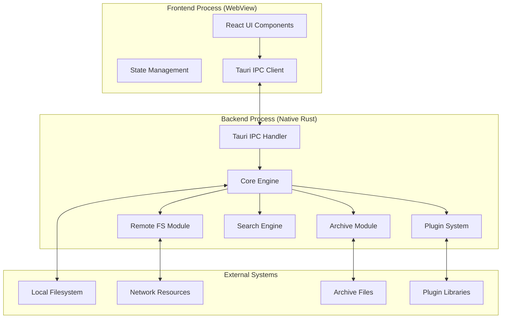

# System Architecture

## Overview

Nimbus follows a **multi-process architecture** leveraging Tauri's design where the React frontend runs in a WebView process while the Rust backend executes in a separate native process. This separation ensures heavy operations don't block the UI while maintaining security through controlled IPC channels.



## Backend Architecture (Rust)

### Modular Crate Design

The backend is organized into specialized Rust crates, each with focused responsibilities:

```rust
// Project structure
src-tauri/
├── Cargo.toml
├── src/
│   ├── main.rs           // Tauri app initialization
│   ├── commands/         // IPC command handlers
│   └── lib.rs           // Module integration
├── crates/
│   ├── core-engine/     // Core file management
│   ├── archive/         // Archive handling
│   ├── remote-fs/       // Remote protocols
│   ├── search-engine/   // File search
│   └── plugin-sdk/      // Plugin system
```

### Core Engine Crate

**Purpose**: Implements fundamental file management operations and defines common interfaces.

```rust
// Unified FileSystem trait
pub trait FileSystem: Send + Sync {
    async fn list_dir(&self, path: &Path) -> Result<Vec<FileInfo>, Error>;
    async fn read_file(&self, path: &Path) -> Result<Vec<u8>, Error>;
    async fn write_file(&self, path: &Path, data: &[u8]) -> Result<(), Error>;
    async fn copy_file(&self, src: &Path, dst: &Path) -> Result<(), Error>;
    async fn delete_file(&self, path: &Path) -> Result<(), Error>;
    async fn create_dir(&self, path: &Path) -> Result<(), Error>;
    async fn get_metadata(&self, path: &Path) -> Result<FileMetadata, Error>;
}

// Local filesystem implementation
pub struct LocalFileSystem;
impl FileSystem for LocalFileSystem { /* ... */ }

// File information structure
#[derive(Debug, Clone, Serialize, Deserialize)]
pub struct FileInfo {
    pub name: String,
    pub path: PathBuf,
    pub size: u64,
    pub modified: SystemTime,
    pub file_type: FileType,
    pub permissions: FilePermissions,
}
```

**Key Features**:
- Unified API for local, remote, and archive filesystems
- Async operations for non-blocking I/O
- Cross-platform path handling
- Rich metadata support

### Archive Crate

**Purpose**: Provides archive browsing and extraction as virtual filesystems.

```rust
// Archive filesystem implementation
pub struct ArchiveFileSystem {
    archive_path: PathBuf,
    archive_type: ArchiveType,
    entries_cache: Arc<RwLock<HashMap<PathBuf, Vec<ArchiveEntry>>>>,
}

#[derive(Debug, Clone)]
pub enum ArchiveType {
    Zip,
    Tar(CompressionType),
    SevenZ,
    Rar,
}

impl FileSystem for ArchiveFileSystem {
    async fn list_dir(&self, path: &Path) -> Result<Vec<FileInfo>, Error> {
        // Use appropriate library based on archive type
        match self.archive_type {
            ArchiveType::Zip => self.list_zip_entries(path).await,
            ArchiveType::Tar(compression) => self.list_tar_entries(path, compression).await,
            // ... other formats
        }
    }
}
```

**Library Integration**:
- **ZIP**: `zip` crate for read/write operations
- **TAR**: `tar` + `flate2`/`bzip2` for compressed archives
- **7z**: `sevenz-rust` or external `7z` binary integration
- **RAR**: `unrar` crate or external UnRAR library

### Remote FS Crate

**Purpose**: Implements network protocol support through a unified interface.

```rust
// Remote client abstraction
pub trait RemoteClient: Send + Sync {
    async fn connect(&mut self, config: &ConnectionConfig) -> Result<(), Error>;
    async fn disconnect(&mut self) -> Result<(), Error>;
    async fn list_directory(&self, path: &str) -> Result<Vec<RemoteFileInfo>, Error>;
    async fn download_file(&self, remote_path: &str, local_path: &Path) -> Result<(), Error>;
    async fn upload_file(&self, local_path: &Path, remote_path: &str) -> Result<(), Error>;
}

// SFTP implementation
pub struct SftpClient {
    session: Option<ssh2::Session>,
    sftp: Option<ssh2::Sftp>,
}

impl RemoteClient for SftpClient {
    async fn connect(&mut self, config: &ConnectionConfig) -> Result<(), Error> {
        // Establish SSH connection and SFTP channel
        // Handle authentication (password, key, etc.)
    }
}

// FTP implementation using async-ftp
pub struct FtpClient {
    stream: Option<async_ftp::FtpStream>,
}
```

**Security Features**:
- Secure credential storage (encrypted or OS keychain)
- SSH key authentication support
- Connection pooling and reuse
- Timeout and retry mechanisms

### Search Engine Crate

**Purpose**: High-performance recursive file search with parallel processing.

```rust
use jwalk::WalkDir;
use rayon::prelude::*;

pub struct SearchEngine {
    thread_pool: rayon::ThreadPool,
}

#[derive(Debug, Clone)]
pub struct SearchQuery {
    pub path: PathBuf,
    pub name_pattern: Option<String>,
    pub content_pattern: Option<String>,
    pub size_filter: Option<SizeFilter>,
    pub date_filter: Option<DateFilter>,
    pub file_type_filter: Option<FileTypeFilter>,
}

impl SearchEngine {
    pub async fn search(&self, query: SearchQuery) -> impl Stream<Item = SearchResult> {
        let (tx, rx) = tokio::sync::mpsc::unbounded_channel();
        
        // Spawn parallel directory walking
        tokio::task::spawn_blocking(move || {
            WalkDir::new(&query.path)
                .parallelism(jwalk::Parallelism::RayonNewPool(num_cpus::get()))
                .process_read_dir(move |_depth, _path, _read_dir_state, children| {
                    children.par_iter().for_each(|child| {
                        if let Ok(entry) = child {
                            if Self::matches_criteria(&entry, &query) {
                                let _ = tx.send(SearchResult::from(entry));
                            }
                        }
                    });
                });
        });
        
        tokio_stream::wrappers::UnboundedReceiverStream::new(rx)
    }
}
```

**Performance Features**:
- Parallel directory traversal using `jwalk` and `rayon`
- Streaming results for immediate UI feedback  
- Memory-efficient processing of large directory structures
- Cancellable operations through async coordination

### Plugin SDK Crate

**Purpose**: Defines plugin interfaces and provides safe loading mechanisms.

```rust
// Plugin trait definitions
pub trait ContentPlugin: Send + Sync {
    fn name(&self) -> &str;
    fn supported_extensions(&self) -> Vec<String>;
    fn get_columns(&self, file_info: &FileInfo) -> HashMap<String, String>;
}

pub trait ProtocolPlugin: Send + Sync {
    fn scheme(&self) -> &str;
    fn create_client(&self) -> Box<dyn RemoteClient>;
}

pub trait ViewerPlugin: Send + Sync {
    fn name(&self) -> &str;
    fn supported_types(&self) -> Vec<String>;
    fn render(&self, file_path: &Path) -> Result<ViewerContent, Error>;
}

// Plugin manager with dynamic loading
pub struct PluginManager {
    loaded_plugins: HashMap<String, LoadedPlugin>,
    content_plugins: Vec<Box<dyn ContentPlugin>>,
    protocol_plugins: Vec<Box<dyn ProtocolPlugin>>,
    viewer_plugins: Vec<Box<dyn ViewerPlugin>>,
}

impl PluginManager {
    pub fn load_plugin<P: AsRef<Path>>(&mut self, library_path: P) -> Result<(), Error> {
        unsafe {
            let lib = libloading::Library::new(library_path)?;
            let plugin_register: libloading::Symbol<unsafe extern "C" fn() -> PluginInfo> =
                lib.get(b"plugin_register")?;
            
            let plugin_info = plugin_register();
            // Validate API version and load plugin functions
        }
    }
}
```

**Safety & Sandboxing**:
- **Dynamic Loading**: Use `libloading` for runtime plugin loading
- **ABI Stability**: C-compatible interface or `abi_stable` crate
- **Sandboxing Options**:
  - Process isolation for critical plugins
  - WebAssembly runtime for content plugins
  - Capability-based security model

## Frontend Architecture (React)

### Component Hierarchy

```typescript
// Main application structure
App
├── GlobalContextProvider
├── MultiPanelLayout
│   ├── FilePane (left)
│   │   ├── TabBar
│   │   ├── PathBreadcrumb
│   │   ├── FileListView
│   │   └── StatusBar
│   └── FilePane (right)
│       ├── TabBar
│       ├── PathBreadcrumb  
│       ├── FileListView
│       └── StatusBar
├── Toolbar
├── StatusBar (global)
├── ViewerModal
├── SearchDialog
├── SettingsDialog
└── ContextMenu
```

### State Management

```typescript
// Application context
interface AppState {
    panels: PanelState[];           // Dynamic array of panels (1-6 panels)
    activePanelId: string;          // ID of currently active panel
    layout: PanelLayoutConfig;      // Current layout configuration
    globalSettings: Settings;
    connections: RemoteConnection[];
    searchResults?: SearchResults;
}

interface PanelState {
    id: string;                     // Unique panel identifier
    tabs: TabState[];
    activeTabIndex: number;
    selection: Set<string>;
    viewMode: 'list' | 'grid' | 'details';
    sortBy: SortField;
    sortOrder: 'asc' | 'desc';
    gridPosition?: GridPosition;    // Position in grid layout
    isActive: boolean;             // Whether panel is currently active
}

interface PanelLayoutConfig {
    type: 'single' | 'dual' | 'triple' | 'grid2x2' | 'grid2x3' | 'grid3x2';
    splitterPositions: number[];   // Positions of splitters (0.0-1.0)
    gridDimensions?: {              // Grid-specific configuration
        rows: number;
        cols: number;
        cellSpacing: number;
        uniformSizing: boolean;
    };
}

interface GridPosition {
    row: number;                   // 0-indexed row position
    col: number;                   // 0-indexed column position
    rowSpan?: number;             // Number of rows spanned
    colSpan?: number;             // Number of columns spanned
}

interface TabState {
    id: string;
    path: string;
    files: FileInfo[];
    loading: boolean;
    error?: string;
    history: string[];
    historyIndex: number;
}

// React Context + useReducer for state management
const AppContext = createContext<{
    state: AppState;
    dispatch: Dispatch<AppAction>;
}>({ /* ... */ });
```

### IPC Integration

```typescript
import { invoke } from '@tauri-apps/api/tauri';
import { listen } from '@tauri-apps/api/event';

// Command invocation with type safety
export async function listDirectory(path: string): Promise<FileInfo[]> {
    try {
        const files = await invoke<FileInfo[]>('list_dir', { path });
        return files;
    } catch (error) {
        console.error('Failed to list directory:', error);
        throw error;
    }
}

// Event listening for streaming results
export function subscribeToSearchResults(
    callback: (result: SearchResult) => void
): Promise<() => void> {
    return listen<SearchResult>('search-result', (event) => {
        callback(event.payload);
    });
}

// Progress tracking for long operations
export function subscribeToProgress(
    operationId: string,
    callback: (progress: ProgressUpdate) => void
): Promise<() => void> {
    return listen<ProgressUpdate>(`progress-${operationId}`, (event) => {
        callback(event.payload);
    });
}
```

## IPC Communication Patterns

### Command/Response Pattern

```rust
// Tauri command definition
#[tauri::command]
pub async fn copy_files(
    src_paths: Vec<String>,
    dst_path: String,
    state: tauri::State<'_, AppState>
) -> Result<String, String> {
    let operation_id = Uuid::new_v4().to_string();
    let window = state.window.clone();
    
    tokio::spawn(async move {
        let mut copied = 0;
        let total = src_paths.len();
        
        for src_path in src_paths {
            // Perform copy operation
            let result = fs::copy(&src_path, &dst_path).await;
            
            copied += 1;
            let progress = ProgressUpdate {
                operation_id: operation_id.clone(),
                current: copied,
                total,
                status: if result.is_ok() { "success" } else { "error" },
            };
            
            // Emit progress event
            window.emit("progress", &progress).unwrap();
        }
    });
    
    Ok(operation_id)
}
```

### Event Streaming Pattern

```rust
// Long-running search operation
#[tauri::command]
pub async fn start_search(
    query: SearchQuery,
    state: tauri::State<'_, AppState>
) -> Result<String, String> {
    let search_id = Uuid::new_v4().to_string();
    let window = state.window.clone();
    let search_engine = state.search_engine.clone();
    
    tokio::spawn(async move {
        let mut results = search_engine.search(query).await;
        
        while let Some(result) = results.next().await {
            let search_result = SearchResultEvent {
                search_id: search_id.clone(),
                result,
            };
            
            if window.emit("search-result", &search_result).is_err() {
                break; // Client disconnected
            }
        }
        
        let completion = SearchCompletionEvent {
            search_id: search_id.clone(),
            total_results: results.count(),
        };
        
        window.emit("search-completed", &completion).unwrap();
    });
    
    Ok(search_id)
}
```

## Security Architecture

### Process Isolation
- **Frontend Sandbox**: WebView runs with restricted permissions
- **Backend Privileges**: Native process handles file system access
- **IPC Boundary**: Controlled communication through Tauri's secure channels

### Plugin Security
- **Dynamic Loading**: Plugins loaded as separate libraries with version checks
- **Capability Restriction**: Plugins only access explicitly granted APIs
- **Process Isolation**: Critical plugins can run in separate processes
- **Code Signing**: Plugin verification through digital signatures

### Data Protection
- **Credential Storage**: Secure storage using OS keychain services
- **Memory Safety**: Rust's ownership model prevents common vulnerabilities
- **Input Validation**: All user inputs validated at IPC boundaries
- **Path Traversal Protection**: Canonical path resolution prevents directory escaping

---

This architecture provides a solid foundation for Nimbus, balancing performance, security, and maintainability while supporting extensive customization through the plugin system.